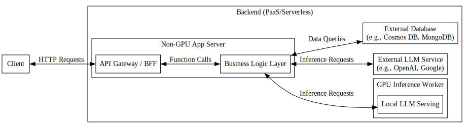
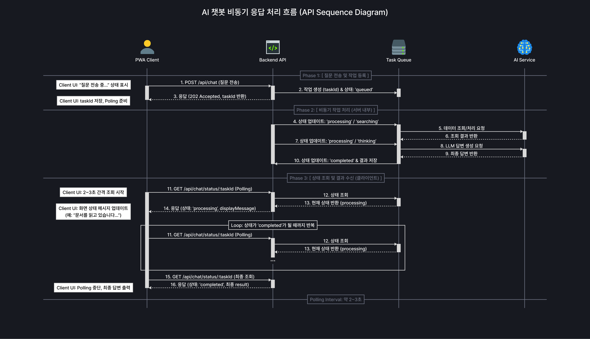

# NAVI BACKEND

## 🚀 핵심 기술

* **백엔드**
    - [Express.js (Node.js)](https://nodejs.org/ko) - 메인 웹 서버 프레임워크
    - [TSOA](https://tsoa-community.github.io/docs/) - 타입 안정성 보장 및 OpenAPI(Swagger) 문서 자동화

* **데이터베이스**
    - [MongoDB (Atlas)](https://www.mongodb.com/) - 대학 생활 및 학사 정보 데이터를 유연하게 다루기 위한 NoSQL DB
    - [Pinecone](https://www.pinecone.io/) - RAG(검색 증강 생성) 파이프라인 처리를 위한 고성능 벡터 데이터베이스

* **AI & LLM 파이프라인**
    - [LangChain](https://www.langchain.com/) - 복잡한 LLM 워크플로우를 쉽게 구성하기 위한 프레임워크
    - [OpenRouter](https://openrouter.ai/) - 다양한 LLM 모델을 일관된 환경에서 호출하기 위한 통합 API 라우터
    - [ElevenLabs](https://elevenlabs.io/) - 챗봇의 텍스트 답변을 음성으로 변환(TTS)하는 고품질 AI 음성 합성 플랫폼

* **외부 서비스 및 알림 (External Services & Notifications)**
    - [Resend](https://resend.com/) - 트랜잭셔널 이메일(메일 인증 등)의 빠르고 안정적인 자동 발송
    - [Discord Webhook](https://discord.com/developers/docs/resources/webhook) - 웹서버 에러 로그 및 시스템 주요 이벤트의 실시간 모니터링 알림

* **인프라 및 데브옵스 (Infrastructure & DevOps)**
    - [Render.io](https://render.com/) - 백엔드 서버 PaaS 호스팅
    - [UptimeRobot](https://uptimerobot.com/) - 24/7 서버 가동 상태 모니터링

## 🧩 아키텍쳐
* **Backend Structure**

<!-- * **API Corresponding Sequence Diagram**
 -->

## 📦 환경 세팅

### 패키지 구동 및 의존성 설치
본 프로젝트는 패키지 매니저로 `pnpm`을 사용합니다. 처음 시작하실 때 아래 명령어를 실행하여 pnpm을 전역으로 설치한 뒤 의존성 패키지를 설치해 주세요.

```bash
npm install -g pnpm
pnpm install
```

### 환경변수 설정 (.env)
각 실행 환경(개발, 테스트, 프로덕션)에 맞게 분리된 환경 변수 체계를 사용합니다. 루트 디렉토리에 다음 파일들을 생성 및 셋업해 주세요.
- **`.env.development`**: `pnpm dev` 실행 시 로드되는 로컬 개발용 (개발/테스트 클러스터 URI 권장)
- **`.env.test`**: `pnpm test` 실행 시 로드되는 단위 테스트용 (인터넷 연결이 필요 없는 로컬/인메모리 DB 권장)
- **`.env.production`**: 배포 서버 운영용

#### 환경 변수 구조 템플릿
```bash
APP_PORT=8000
NODE_ENV=development # 또는 test, production
JWT_SECRET=""
MONGO_URI=""
OPENROUTER_API_KEY=""
RESEND_KEY=""
PINECONE_API_KEY=""
DISCORD_WEBHOOK_URL=""
ELEVENLABS_API_KEY=""
```
```
📁 .
├── 📁 dist
├── 📁 src
├── 📄 .env.development
├── 📄 .env.production
├── 📄 .env.test
└── 📄 README.md
```

### 테스트
> [!NOTE]  
> 단위 테스트; 파일 상단에 실행 명령어를 기재함.

> [!TIP]
> 일부 테스트는 MongoDB 설치가 필요합니다.

```bash
pnpm test
```

## [3] 개발 전략

### 브랜치 구성
> [!IMPORTANT]
> `main` 브랜치를 직접 push 할 수 없습니다.
 
| 브랜치 이름 | 역할 및 정의 | 관리 규칙 |
| --- | --- | --- |
| `production` | 실제 서버 배포용 | `main`에서 검증된 릴리즈 버전(커밋)으로 병합 |
| `main` | 정식 릴리즈 및 배포 기준 | 병합 시 GitHub Actions로 자동 버전 태그 및 릴리즈 생성. (PR 병합 필수) |
| `develop` | 코드 통합 및 테스트 | `feature` 브랜치들이 모이는 개발 메인. (PR 병합 필수) |
| `feature/*` | 개별 기능 개발 | `develop`에서 분기 후 개발, 완료 시 `develop`으로 PR. |
| `hotfix/*` | 운영 환경 긴급 수정 | `main`에서 직접 분기 후 수정, `main`과 `develop`에 각각 PR. |

### GitHub Apps 통합
코드 품질 향상과 프로젝트 관리 효율화를 위해 다음의 자동화 봇을 연동하고 있습니다.
* **[Gemini Code Assist](https://github.com/apps/gemini-code-assist):** AI 기반 자동 코드 리뷰 봇. Pull Request 생성 시 코드 변경 사항을 분석하여 리뷰 및 피드백을 제공합니다.
* **[Coder Labeler](https://github.com/apps/coder-labeler):** 자동 이슈 라벨링 봇. 이슈가 등록되면 내용을 분석하여 알맞은 카테고리/라벨을 자동으로 부착해 줍니다.

### 릴리즈 및 버전 관리 자동화 (GitHub Actions)
`.github/workflows/release.yml`을 통해 릴리즈 관리 파이프라인이 자동화되어 있습니다.
- **트리거:** 코드가 `main` 브랜치에 반영(Merge)될 때 작동합니다.
- **자동 버전 범프:** 커밋 메시지를 기반으로 다음 버전 넘버를 계산하고 자동으로 Git 태그를 푸시합니다. (기본적으로 Patch 버전 상승)
- **릴리즈 노트 작성:** 커밋 내역(Changelog)을 정리하여 GitHub Releases 페이지에 새로운 릴리즈를 자동 생성합니다.
- **패키지 버전 동기화:** API 명세(Swagger) 등에 동일한 버전이 반영될 수 있도록 `package.json`의 버전을 업데이트하고 자동으로 새 커밋(`[skip ci]`)을 남깁니다.

## [4] 배포 및 유지 가이드

`production` 브랜치의 커밋이 바뀌면 자동으로 배포됨.
- Base URL: `https://erica-capstone-2026-backend.onrender.com`
- Swagger Spec: https://erica-capstone-2026-backend.onrender.com/api-docs

## [5] 부록
